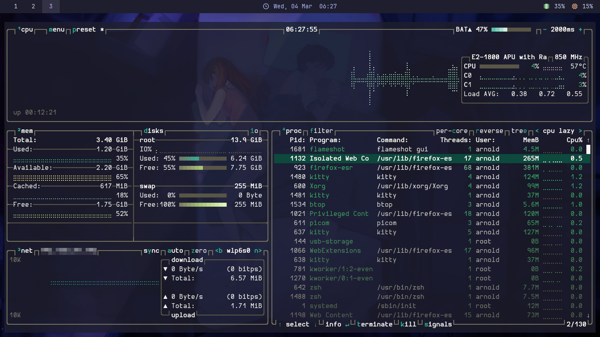
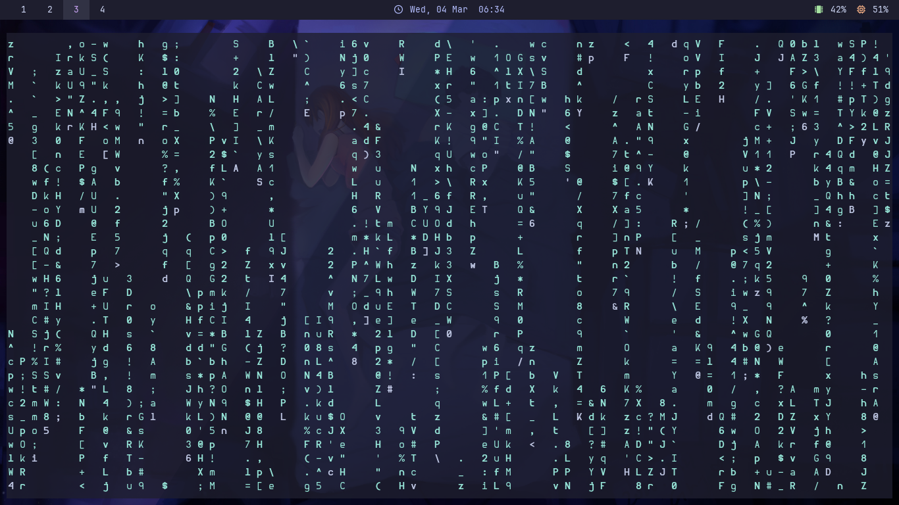
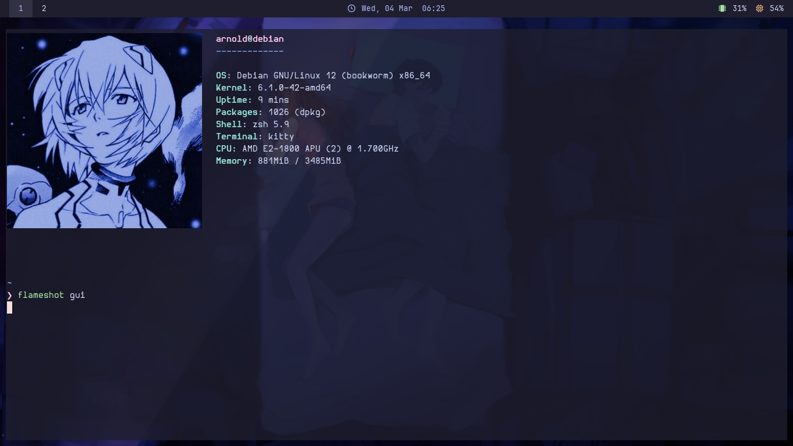

# i3 Debian Rice – Portable USB Setup

Debian 12 rice running:

- i3
- polybar
- kitty
- rofi
- btop
- neofetch
- cmatrix

All configs must be placed in `~/.config` for portability.

## Screenshots





## Installation

```bash
git clone git@github.com:arnoxldq/i3-dotfiles.git
cd i3-Dotfiles
cp -r * ~/.config
cp .xinitrc ~/.xinitrc
cp .zshrc ~/.zshrc

